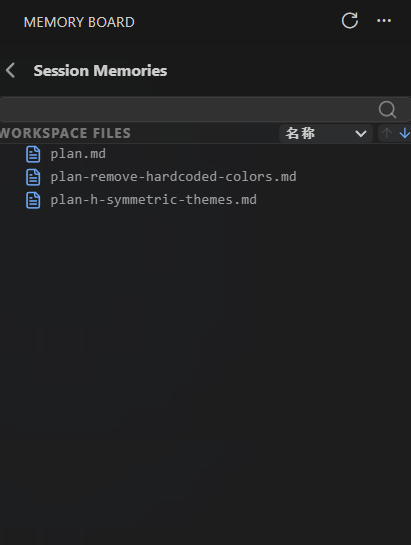
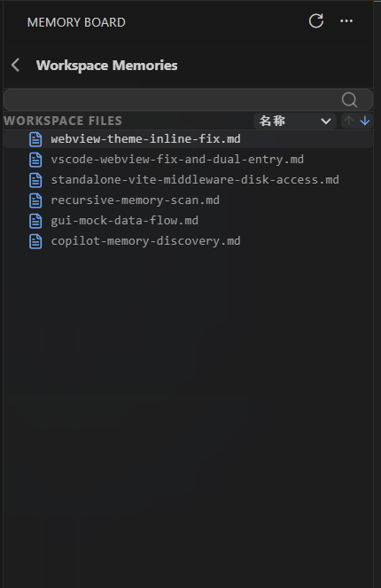

# Copilot Memory Board

> [English](./README.md) | **中文**

**在 VS Code 中以交互式看板的方式，可视化和管理 GitHub Copilot 的记忆。**

GitHub Copilot 在每次对话中会积累「记忆」——记录你的项目上下文、编码偏好、架构决策等长期信息。这些记忆以 Markdown 文件的形式存储在本地磁盘上，但原生并没有提供浏览和管理的界面。

**Copilot Memory Board** 填补了这个空白：它在 VS Code 侧边栏中提供了一个自适应的看板界面，让你可以按 **工作区 → 会话 → 记忆条目** 三级结构浏览、搜索和管理所有 Copilot 记忆。

---

## ✨ 功能特性

### 📂 工作区级记忆浏览
- 自动扫描本地所有包含 Copilot 记忆数据的工作区
- 展示每个工作区的会话数量、最近修改时间等摘要信息
- 支持「工作区级目录」视图——查看跨会话共享的仓库级记忆

### 💬 会话级记忆浏览
- 按工作区筛选出所有会话，展示会话标题、创建时间、条目数量
- 支持排序（按时间、名称）和搜索过滤
- 会话标题从聊天记录的 `customTitle` 或首条用户消息自动推导

### 📝 记忆条目详情
- 递归扫描会话目录下的所有文件和子目录，以树形结构展示
- 支持 Markdown 渲染预览和原始文本查看

  
   
  <em>会话级记忆浏览 —— 查看单个会话中 Copilot 记住了什么</em>

  
   
  <em>工作区级记忆浏览 —— 查看跨会话共享的仓库级记忆</em>

---

## 📄 许可证

[MIT](./LICENSE)
